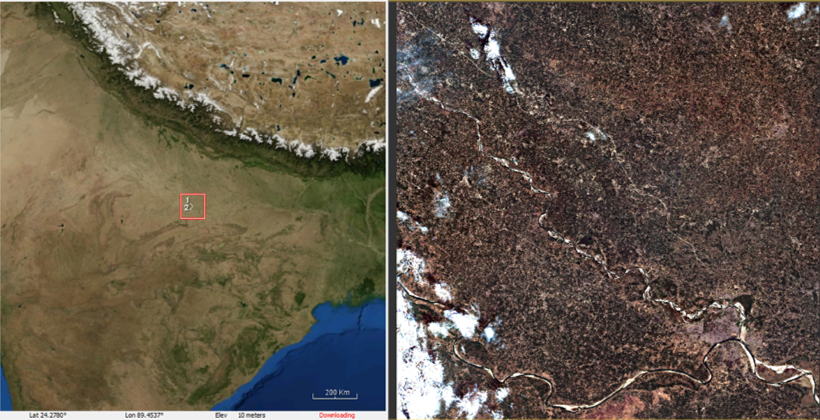
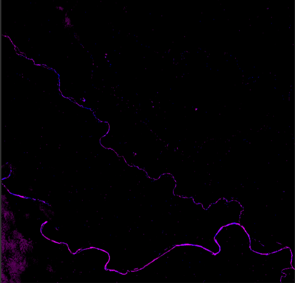
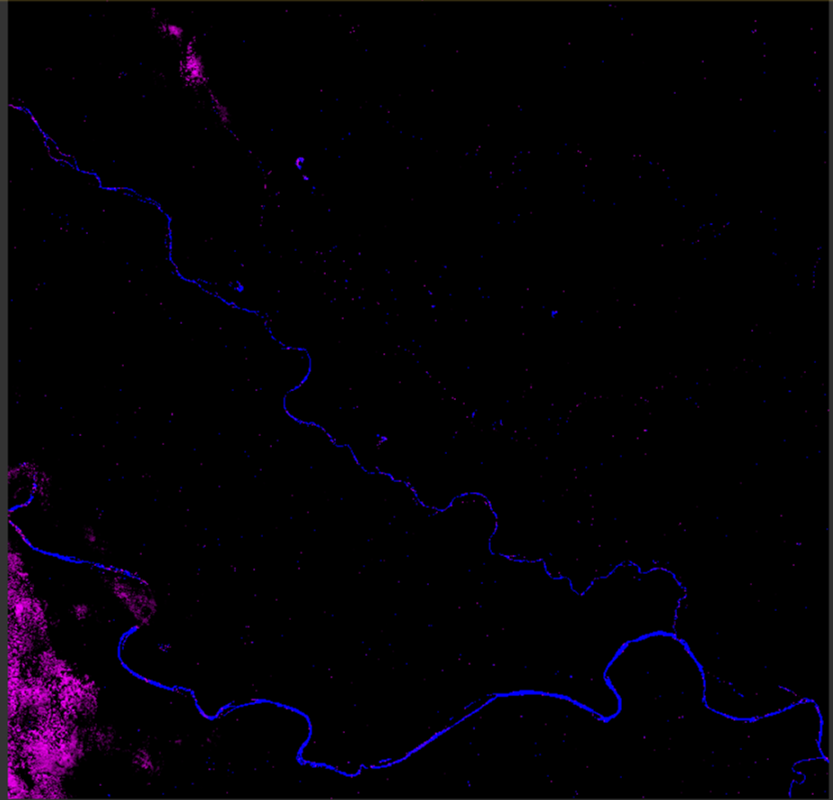

# Automatic Flood Event Detection Using Satellite Images

## Project Overview

This project aims to detect flood events using satellite images automatically. To achieve this, we conducted a comprehensive study of various water detection indices. Ultimately, we selected the BLUE, Green, and NIR bands for flood detection.

The choice of Sentinel-2 satellite data was driven by its frequent revisit times, availability of most optical bands, and popularity, providing easy access to a suitable dataset for model training.

## Model Selection

After careful consideration, we opted for the ResNet model due to its top performance in the ILSVRC 2015 challenge. However, during model training, we encountered slow training speeds due to the addition of a dropout layer and ResNet's inherent batch normalization inside its CNN layers. To overcome this, we decided to employ transfer learning for our model training.

## Transfer Learning Approach

For transfer learning, we utilized the IMAGENET dataset for model training. Since IMAGENET data significantly differs from satellite images, we chose not to freeze any layers during training. Instead, we initialized each layer's weights using the model trained on the IMAGENET dataset.

## Addressing Cloud Misclassification

During model testing, we noticed that many cloudy images were misclassified as flooded images. To distinguish between clouds and floods, we researched various methods and found that ISRO (Indian Space Research Organization) used the SWIR band for cloud detection in their 2019 research paper "DEEP CONVOLUTIONAL NETWORKS FOR CLOUD DETECTION USING RESOURCESAT-2 DATA."

*Original Image with cloud and water (river)*

*Image after applying NDWI Index => Water and clouds are misclassified*

*Image after applying New Index (Combination of Blue, Green, NIR, SWIR) => Water and clouds are properly classified*

After getting this result we feed the new combination of Bands into Our new CNN Model

## Enhanced Model Architecture

To leverage the information from all four bands (BLUE, GREEN, NIR, and SWIR), we faced a challenge due to most transfer learning models being trained on RGB images (3 channels). To address this, we devised a new approach for transfer learning:

1. Pass the first three channels (BLUE, GREEN, NIR) into the model and obtain the output before the fully connected layer.
2. Repeat the process with the last channel (SWIR), converting it into a 3-channel image by replicating the same channel three times.
3. Concatenate both results from the previous steps.
4. Apply four dense layers with 0.5 dropout to produce the final prediction.

## Impressive Results

Through our innovative approach, we achieved an impressive accuracy of 98.2% in flood event detection. This accuracy demonstrates the potential of our model for real-world flood monitoring applications.

.png)

*Final Result Displayed Using Confusion Matrix*
